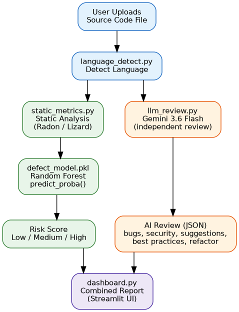
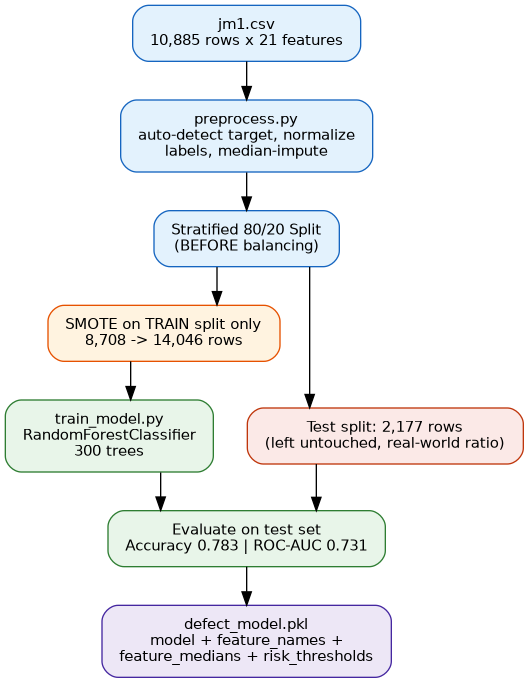
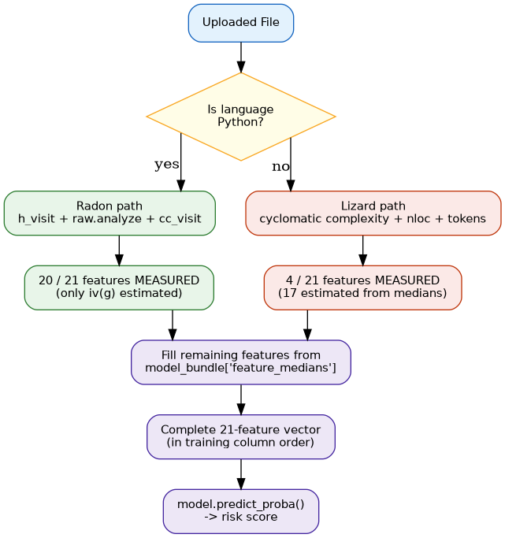

# 🔍 CodeSense AI

**What if code review didn't have to choose between "data-driven" and "explainable"?**

Most AI code review tools give you one opinion from one LLM. CodeSense AI gives you two independent signals instead — a machine learning model that's actually learned from thousands of real historical software defects, and a large language model that reads your code the way a human reviewer would. Neither one has to agree with the other, and that's the point.

Built as an MSc Computer Science research project at Indira University, School of Information Technology.

---

## The problem with most AI code reviewers

Manual code review doesn't scale, and it's inconsistent depending on who's reviewing. Static analysis tools catch syntax issues but can't explain *why* something is risky. And most "AI code review" tools today are just an LLM's opinion dressed up as a verdict — no grounding in what actually tends to cause defects in real software.

CodeSense AI's answer: don't make one model do both jobs.

## How it works

Upload a file. Two independent branches run in parallel, then merge into one report:



- **The ML branch** doesn't read your code at all — it reads *metrics about* your code (complexity, size, structure) and asks: "historically, across 10,885 real NASA software modules, how often did code that looked like this turn out to have a defect?" That gives you an objective, quantitative Low/Medium/High risk score.
- **The LLM branch** (Gemini) does read your code, and judges it on its own merits — bugs, security issues, style, a possible refactor — without ever being told what the ML model concluded.

Neither branch is allowed to bias the other. You get a risk score you can audit against real data, and a review you can actually understand.

## Training the ML model

The Random Forest model isn't trained on your code — it's trained once, offline, on the JM1 dataset from the NASA/PROMISE Software Defect Repository:



The key detail: SMOTE (used to balance the ~81/19 class imbalance) is applied **only** to the training split — the test set keeps the real-world imbalance, so the reported metrics (0.783 accuracy, 0.731 ROC-AUC) reflect genuine performance, not an inflated number from evaluating against synthetic data.

## Making it work across languages

Here's the catch: the JM1 dataset's 21 features are Halstead/McCabe software metrics — deeply tied to how Python's own `ast` module parses code. Only one tool computes those precisely: **Radon**, and it only works on Python.

So what happens when someone uploads a Java or JavaScript file?



Python gets 20 of 21 features measured directly. Every other supported language gets 4 of 21 measured (via Lizard, which is language-agnostic but structural-only) and the rest filled in from the training set's own medians — and the UI **tells you this explicitly**, rather than pretending every prediction is equally trustworthy.

## Supported languages

| Language | Feature Coverage | Tool |
|---|---|---|
| Python | Full — 20/21 measured | Radon |
| Java, JavaScript, TypeScript, C, C++ | Partial — 4/21 measured, rest estimated | Lizard |

## Tech Stack

- **ML:** scikit-learn (Random Forest), imbalanced-learn (SMOTE), pandas, numpy
- **Static Analysis:** Radon (Python), Lizard (multi-language)
- **LLM:** Google Gemini 3.6 Flash via `google-genai`
- **UI:** Streamlit + Plotly
- **Dataset:** [JM1 — NASA/PROMISE Software Defect Repository](https://www.kaggle.com/datasets/kishan0426/software-defect-prediction-jm1)

## Model Performance

Held-out test split, 2,177 real JM1 modules:

| Accuracy | Precision (Defective) | Recall (Defective) | F1 | ROC-AUC |
|---|---|---|---|---|
| 0.783 | 0.430 | 0.380 | 0.404 | 0.731 |

0.731 ROC-AUC lines up with published Random Forest results on JM1. The app buckets `predict_proba()` output into risk bands rather than using a hard 0.5 cutoff, so ROC-AUC — not the hard-cutoff recall — is the number that reflects how the model is actually used.

## Project Structure

```
codesense-ai/
├── training/           # Dataset preprocessing + model training
├── analysis/           # Multi-language static metric extraction
├── ai_review/          # Gemini-based independent code review
├── app/                # Streamlit dashboard
├── tests/              # Pytest regression suite (13 tests)
└── test_samples/       # Sample files across languages/risk levels
```

## Setup & Run

```bash
git clone https://github.com/<your-username>/codesense-ai.git
cd codesense-ai
chmod +x run.sh
./run.sh
```

`run.sh` handles virtual environment setup, dependency installation, model training (if `models/defect_model.pkl` doesn't already exist), running the test suite, and launching the app — in that order.

**Before running:** copy `.env.example` to `.env` and set a real `GEMINI_API_KEY` (get one at [aistudio.google.com/apikey](https://aistudio.google.com/apikey)). Without it, the ML risk scoring still works; only the AI review panel will show an error.

## Testing

```bash
pytest tests/test_pipeline.py -v
```

13 tests covering language detection, static analysis edge cases (syntax errors, empty files, missing files), and LLM response parsing (including malformed JSON recovery).

## Live Demo

**[codesense-ai-46bajkw35e5m7xtpvwtwvj.streamlit.app](https://codesense-ai-46bajkw35e5m7xtpvwtwvj.streamlit.app/)**